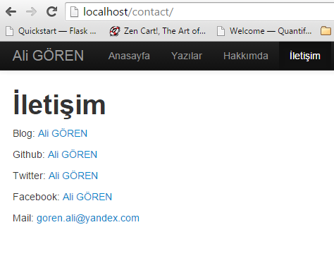

#Flask Blog Uygulaması

Bu uygulama Flask Framework kullanılarak yazılmıştır. Tema sistemi olarak Bootstrap 3 ve Jinja2 kullanılmıştır.

`python main.py` yazarak çalıştırabilirsiniz.

#Ekran Görüntüleri

**Anasayfa**

**İçerik sayfası**

**Sayfa Görünümü**

**Hata Sayfası**

**Admin Giriş Sayfası**

**Yazı Ekleme Sayfası**

